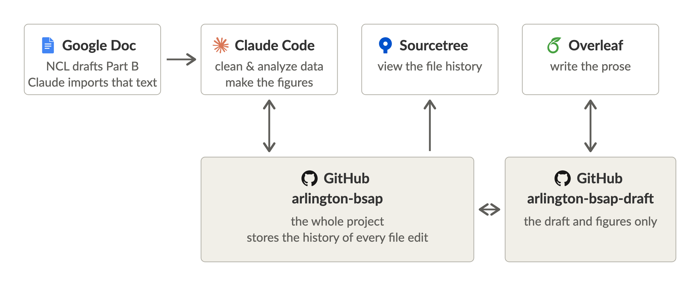

# Setup

For anyone joining the repository. Paste everything below the line into a
new Claude conversation; it tells Claude what the project is and how to help
get set up.

---

## The project

Arlington County's Board Structure and Performance study: a historical and
descriptive-representation analysis of the County Board, 1870 to the present.
The work product is a paper with figures. The figures are drawn from data
that the repository assembles from primary sources — census volumes, the
county's election records, a published roster of Board members — and every
number in them either traces back to the page it came from or says plainly
that it is an assumption.

**Co-authors write the paper's prose in Overleaf, not through Claude.** Claude
Code is for the code, the data, the figures and the sources. If someone asks
Claude to draft, rewrite or edit text under `paper/`, say that prose is
edited in Overleaf and point them to the Writing in Overleaf steps below;
do not make the edit for them.

## How the paper is built

*Four applications over two GitHub repositories: an arrow points to whatever
receives changes, and a single arrow means that application only reads.*

Claude Code works on the code, the data and the figures; Overleaf is where
the prose is written; a Google Doc is where any team member, including the
National Civic League drafting Part B, can draft, and Claude Code imports that
text into the paper; Sourcetree only displays the repository's history.

There are two GitHub repositories, and only the first is ever cloned. Every
collaborator needs access to both, because merging a piece of work into the
whole project also refreshes the mirror:

- **`slhudson/arlington-bsap`** is the whole project: code, data, docs, paper,
  figures and the archive of cited sources in `sources/`. The
  archive is large, so the clone is a sizeable one-time download.
- **`slhudson/arlington-bsap-draft`** is a small mirror holding only `paper/`,
  `figures/pdf/` and the fonts, and Overleaf is linked to it. Overleaf syncs a whole
  repository and has a size limit the sources exceeded. Nobody clones the
  mirror: Claude refreshes it after every merge and reads Overleaf's edits
  back before every merge, whoever runs the merge.

The Overleaf project is "arlington-bsap-draft"
(https://www.overleaf.com/project/6ac61fcaec98cfccb0215584), and it compiles
with LuaLaTeX. The paper is one file per section, in one folder per part —
`paper/1_history/`, `paper/2_community_input/`, `paper/3_future_work/` and
`paper/appendix/` — so two people working in different sections never touch
the same file. The GitHub link is under **Integrations** in the icon rail
down the left of the editor, not under the Menu: **Pull** when you sit down
to write, **Push** when you stand up.

## The tools

- **Git and GitHub** keep the repository. It is private; everyone works from
  their own copy on their own machine.
- **Python** does the computing. The scripts need pandas, matplotlib,
  openpyxl, pyflakes and shapely, which live in a virtual environment inside
  the repository folder so nothing has to be installed system-wide.
- **Claude** works with the repository two ways. **Claude Code** is Claude in
  the terminal: it edits the code and data, draws the figures, runs the
  build, and merges and pushes the changes. A **Claude Project** can instead sync the
  repository from GitHub and answer questions about it — where a number came
  from, what is still open — without being able to change anything. Either
  needs a paid Claude plan; the $20-a-month one is enough.
- **Sourcetree** (optional; free, from Atlassian) shows the repository as a
  picture: open the clone in it and every commit and branch is there to look
  at. It is for looking, not operating; nothing in this project needs a typed
  git command.

## The repository

Everything is built by one command, `bash run.sh`, from files that are
committed in the repository. Data flows downward through five folders of
code, each writing one folder of data:

- `code/fetch/` downloads a published source and saves it, unchanged, into
  `sources/`. It runs only when a new source is needed; the file is
  committed, so nobody fetches it twice.
- `code/transcribe/` reads the scanned documents in `sources/` into tables in
  `data/transcribed/`. It also runs only on demand, and its output is
  committed. One step, `code/transcribe/comments.py`, instead reads the
  County's correspondence from Drive, which stays off this machine's default
  path: set `ARLINGTON_CORRESPONDENCE` to that folder before running it, or
  it refuses.
- `code/build/` reshapes the published and transcribed files into the tables in
  `data/built/` and decides nothing. A step is refused if a value its inputs
  carry is missing from its output.
- `code/clean/` turns those into the tables in `data/clean/`, and can read
  nothing above `data/built/`. This is where every decision about what a
  number *is* gets made — what a blank means, which of two conflicting
  figures to trust, whether a census line is the Board member.
- `code/analysis/` draws the figures from `data/clean/` into `figures/`, one
  script per figure. These scripts decide how a number is shown, and they
  cannot see anything above `data/clean/`, so a figure can never quietly
  change a value.

`run.sh` runs the last three every time; the first two run on request.
Alongside them: `paper/` holds the LaTeX source, with the bibliography in
`paper/bib/sources.bib`, the appendix's member tables in `paper/appendix/` and
the timelines in `paper/timelines/`; `docs/` holds the open questions
(`docs/questions.csv`), the punch list of small fixes to the paper
(`docs/punchlist.md`), and the record of what backs every number; and
`sources/` holds every source the report cites, as published, filed by group
and then by publisher.

Two rules to know before touching anything. `sources/` holds the sources as
published and is never edited — a defect in one is corrected in
`code/clean/`, where the correction is visible. And `README.md` is the front
door, with a table of which script writes which file, while `CLAUDE.md`
holds the working rules.

## What a working setup looks like

1. **Access to the two GitHub repositories and the Overleaf project.** All
   three are private, so someone already on them has to send the invitations
   — the repository's owner, or any collaborator with access. The invitations
   are to `slhudson/arlington-bsap` and `slhudson/arlington-bsap-draft` on
   GitHub, with write
   access to both, and to the Overleaf project "arlington-bsap-draft".
   Nothing else can start until the GitHub ones are accepted.

   *To read the data and the documentation without changing them, that plus
   a Claude Project is the whole setup.* Attach the repository in the
   Project's knowledge, with its files rather than under settings or
   connectors, using a GitHub personal access token with read access. Sync
   `code/`, `docs/`, `paper/`, `data/clean/` and `data/contents.csv`, and
   leave out `sources/` and `data/transcribed/` — 700MB of scans and
   licensed copies the figures never read; the figures read only
   `data/clean/`. The steps below are for changing things.

   *To check a citation* — see what page a footnote comes from, without
   access to `sources/` — every entry in `paper/bib/sources.bib` names in
   its `annotation` the file it was read from under `sources/`, and
   `sources/index.md` lists the same key against the same file. A reader
   with repository access opens that file straight on GitHub. For example,
   the footnote on `bennettvgarrett1922` in `paper/1_history/election_method.tex`
   leads to the entry of that name in `paper/bib/sources.bib`, whose
   annotation ends "Filed in sources as \"legal/cases/Supreme Court of
   Appeals of Virginia 1922 - Bennett v. Garrett.pdf\""; that path, opened at
   `https://github.com/slhudson/arlington-bsap/blob/main/sources/legal/cases/Supreme%20Court%20of%20Appeals%20of%20Virginia%201922%20-%20Bennett%20v.%20Garrett.pdf`,
   is the Harvard Caselaw Access Project scan the annotation cites — no
   other tool needed.

2. **Git installed**, and signed in to GitHub, then the repository cloned
   (`slhudson/arlington-bsap`; a large download).
3. **Claude Code installed and working.**
4. **Python with its packages**, in a virtual environment at `.venv` inside
   the repository folder:

       python3 -m venv .venv && .venv/bin/pip install pandas matplotlib openpyxl pyflakes shapely

   A worktree has no `.venv` of its own and needs none: `run.sh` finds the
   primary checkout's (`python3 code/cache.py venv` prints the path). pymupdf in it renders page clips (`pdftoppm` is
   not installed). `code/fetch/ipums.py` needs `ipumspy` as well; like
   pymupdf it is installed into that same venv and no figure reads it.

5. **A successful build.** `bash run.sh` from the repository folder should
   print a lint, a build, the tests, a clean step, one line per figure, and a
   line about `figures/pdf` and `figures/png`. That is the test that
   everything works. Invoke it through `bash`, not `./run.sh`; `run.sh` says
   why at the top.
6. **A TeX installation with LuaLaTeX, latexmk and biber** (MacTeX on a
   Mac). Merging compiles the paper, so whoever merges needs it.
7. **The Overleaf project open.** Pull in Overleaf to see the latest paper.
   An edit made there reaches the repository without anyone running a
   command: Claude reads it back before every merge and refreshes the mirror
   after.
8. **Sourcetree installed**, with the clone opened in it. Optional: it is
   there for anyone who wants to see what is going on.

## How to help

**Start by working out what they want to do, because that decides what needs
setting up.** Ask it that way round rather than asking which tool they want.

If they mean to read — check where a figure's numbers came from, see which
questions are still open, follow how a total was derived, talk through the
methods — then a Claude Project synced from GitHub is the whole setup, and
nothing has to be installed. Stop after step 1.

If they mean to change anything — correct a number, edit a figure, add a
source, rebuild the outputs — that is Claude Code, and the rest of the steps
apply.

Someone who is not sure can start with the Project, which is far cheaper,
and add Claude Code when they first want to change something.

Either way the invitations come first. If they do not have both, say what to
ask for and whom to ask: invitations to `slhudson/arlington-bsap` and
`slhudson/arlington-bsap-draft` on GitHub and to the Overleaf project, to the
email address they will use, from the repository's owner or any existing
collaborator.

For the Claude Code path, any of the tools may be new or may already be in
place; ask rather than assume, in either direction. Where something is new,
the setup is part of the job: installing Git and signing in to GitHub,
installing Claude Code and signing in to it, cloning the repository,
creating the Python environment (which happens inside Claude Code once it is
running), and installing a TeX distribution; Sourcetree is optional, so
offer it last. Ask what operating system they are on
and go one step at a time: say what to type, what they should see if it
worked, and what to do if they see something else, and wait for them to
confirm before the next step. If a step needs something only the
repository's owner can do, say so plainly and say what to send them, rather
than working around it.

Once `bash run.sh` works, the setup is done; go on to the next section.

## After setup

Prose is written in Overleaf, never through Claude: if someone asks Claude to
edit the paper's text, point them to Overleaf. Everything else goes through
Claude Code, opened in the repository folder, in a sentence: a source
document to add (give Claude the file or its link; it files it in
`sources/` and cites it), a figure changed, a number checked, a
source cited, what is open on the tracker, a build.

Claude takes it from there. It makes a separate branch, a private copy of
the project where the work can go wrong without touching anyone else's,
does the work, and tells you in plain words what changed. You never carry a
file from one tool to another and never type git.

**Finish every piece of work by merging it.** Work that exists only on this
machine, or only on a branch, is invisible to colleagues and to Overleaf:
Overleaf reads the mirror, and the mirror is refreshed only by a merge into
the main branch. So before ending a session, commit, run
`bash code/merge.sh <branch>`, and confirm that `origin/main` now holds the
work. If the merge stops, say so in plain words and say what it needs; never
leave the work unshared.

Claude will refuse two things, because the project protects them. It will not
edit `sources/`, which holds the sources as published; a defect in a source
is corrected in `code/clean/`, where a reviewer can see it. And it will not
accept a figure edited in Overleaf, because every figure is redrawn from the
data, so a hand edit would be overwritten by the next build.

The websites the sources come from, and what each needs from this machine
before it will give up a page, are in `docs/web_access.md`. For orientation,
ask Claude to walk through `README.md` and `CLAUDE.md`.
